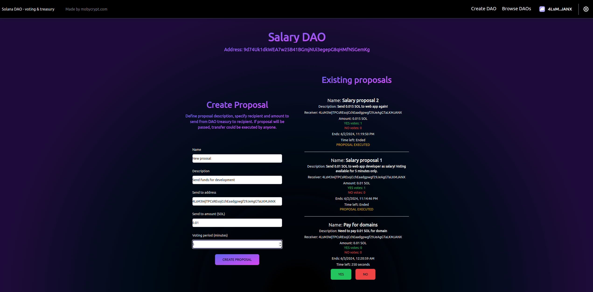

## Solana DAO
This is Solana DAO program.
It allows to create on-chain Solana DAO with treasury (owning SOL). Users can create DAO proposals containing
assets (treasury) transfers to any address. Proposals can be voted by any user (once).
If proposal is passed and has more YES votes than NO, assets transfer from DAO treasury can be 
executed by anyone.

Application (Solana DEVNET): [https://solana-5ae6u6p3c-peerzetzzzzzs-projects.vercel.app](https://solana-5ae6u6p3c-peerzetzzzzzs-projects.vercel.app)

Solana program (DEVNET): [https://explorer.solana.com/address/SxDdnnHxfc2NmCoGrBQneWu5TmEw5qypGtoXsyQpbJZ?cluster=devnet](https://explorer.solana.com/address/SxDdnnHxfc2NmCoGrBQneWu5TmEw5qypGtoXsyQpbJZ?cluster=devnet)  

## Features
- create DAO (name, description, treasury) - name must be unique, treasury is provided during creation and 
sent from signer account
- create proposals (name, description, deadline, send amount, receiver) - proposals lock "send amount" in DAO until 
proposals is finished. Users can vote YES or NO. Every DAO can have many proposals.
- vote on proposals - every user (address) can vote once on proposal
- execute proposal - once proposal voting period ends, passed proposal (more YES than NO votes) can be executed by any user.
Executing proposal means sending "send amount" specified in proposal to "receiver" also specified in proposal.
Once proposal is executed, it changes status to closed.